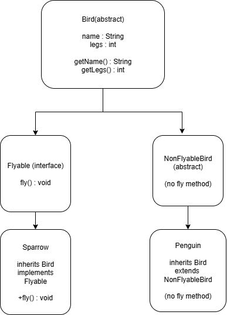

In this design, Liskov Substitution Principle is implemented 
by ensuring that any subclass (like Sparrow or Penguin) 
can be substituted for its parent type Bird without 
breaking functionality. Flying birds implement the Flyable 
interface, while non-flying birds don’t, preventing misuse 
and keeping behavior consistent.

## uml diagram

